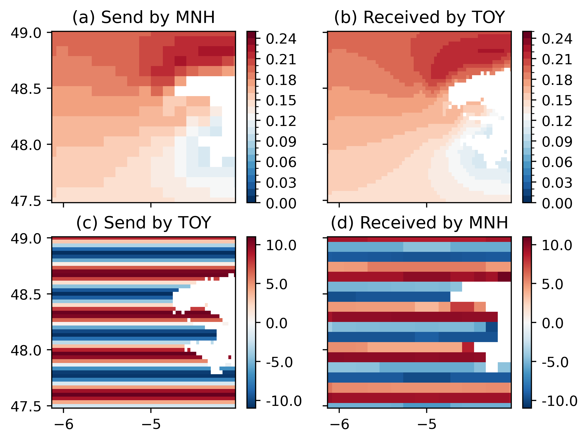

# pytools at laero

## Example

| Plot 1 | Plot 2 | Plot 3 | Plot 4 |
| ----   | ----   | ----   | ----   |
|  | | | |
| [View source](view/plot1.md) |[View source](view/plot1.md) |[View source](view/plot1.md) |[View source](view/plot1.md) |
