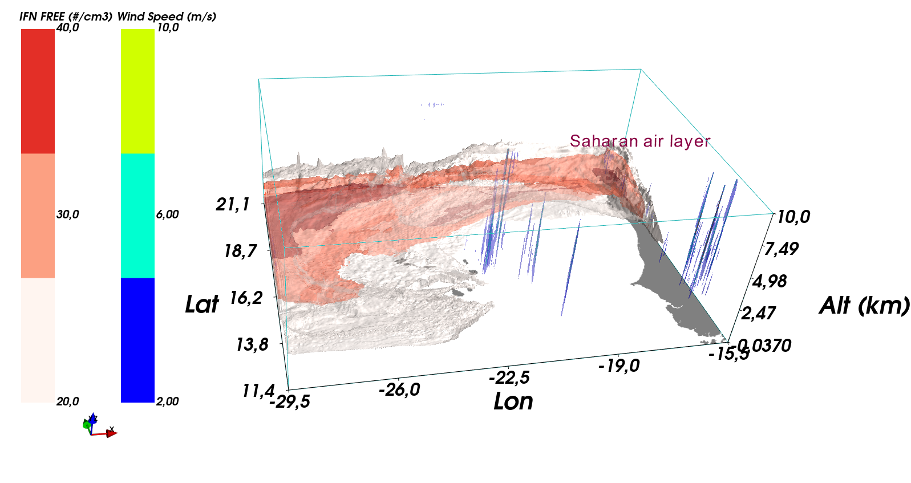

## Plot 1

# --------------------------------------------------------
#
#                 G. Feger  (    06/02/2024   )
#
#                    ~~~~~~~~~~~~~~~
#       Script used to visualize aerosol cloud interaction
#     in the case of a dusty Saharan Air Layer at Cape Verde
#                    ~~~~~~~~~~~~~~~
#
# --------------------------------------------------------

# ~~~~~~~~~~~~~~~~~~~~~~~~~~~~~~~~~~~~~~~~~~~~~~~~~~~~~~~~
import matplotlib as mpl                ; import matplotlib.pyplot as plt
from matplotlib import cm               ; from matplotlib.colors import ListedColormap
import numpy as np                      ; import pandas as pd
import cartopy                          ; import cartopy.feature as cfeature
import xarray as xr                     ; import math ; import numpy.ma as ma
import datetime                         ; from netCDF4 import Dataset
import cftime                           ; import os
import datetime                         ; import cartopy.crs as ccrs
import scipy                            ; from scipy.stats import gmean
import fct                              ; from scipy.interpolate import interpn
import PyQt5                            ; import mayavi   ; from mayavi import mlab
import metpy                            ; import metpy.calc as mpcalc
from metpy.cbook import get_test_data
from metpy.interpolate import cross_section
from mpl_toolkits.basemap import Basemap, shiftgrid
import pandas as pd
from IPython.display import display, HTML
display(HTML(""))

# MAYAVI 3D plot
%gui qt 
# lecture fichier méso-nh
def process_data(directory, pattern, endwith):
    nc_files = [os.path.join(directory, filename) for filename in os.listdir(directory) if filename.endswith(endwith) and filename.startswith(pattern)]
    datasets = [xr.open_mfdataset(file,combine='by_coords') for file in nc_files]
    ho = xr.concat(datasets, dim='time', join='override')
    ho = ho.sortby('time')
    ho = ho.assign_coords(nj=('nj', ho.latitude[:,0].values), ni=('ni', ho.longitude[0,:].values), nj_u=('nj_u', ho.latitude[:,0].values), ni_u=('ni_u', ho.longitude[0,:].values)).rename({'ni': 'lon', 'nj': 'lat', 'ni_u': 'lon_u', 'nj_u': 'lat_u'})
    return ho
m1  = process_data('.' , 'CMS01.1.SEG01.OUT.012', '.nc')
pgd = process_data('.' , 'AFCAV', '.nc')

# prepare le domaine 3d
step    = 0
lon     = m1.lon.values
lat     = m1.lat.values
alt     = m1.level_w.values/1000                          # en km
topo    = pgd.CLAY[0,:,:].values/1000
Z_plot  = 10                                              # Z_plot = alt[-1] si on veut visu tout le domaine sans zoomer
alt_reg = np.linspace(0,Z_plot,101)                       # altitude dz fixe pour interpolation et plot
x, y, z = np.meshgrid(lon, lat, alt_reg, indexing='ij')   # grille 3D : dx dy dz constant
# selection des variables
var1 = m1.WT[step, :, :,:].values      
var2 = m1.NIF01[step, :, :,:].values       
var1 = np.transpose(var1, (2, 1, 0))                       # Z en 3e position
var2 = np.transpose(var2, (2, 1, 0))                       # Z en 3e position 
var1 = interpn((lon, lat, alt), var1, (x, y, z), method='linear', bounds_error=False, fill_value=0)  # interp variables sur domaine régulier
var2 = interpn((lon, lat, alt), var2, (x, y, z), method='linear', bounds_error=False, fill_value=0)

# --  Figure  --
fig       = mlab.figure(bgcolor=(1,1,1), fgcolor=(0.,0.,0.))
ratio=2
pltextent = (lon[0], lon[-1], lat[0], lat[-1], alt[0]/ratio, Z_plot/ratio)   # rapport d'aspect de la fig pour lisibilité
contour1 = mlab.contour3d(x,y,z/ratio,var1, vmin=2, vmax=10 , contours=[2,5,10],   transparent=True,opacity=0.7)
contour2 = mlab.contour3d(x,y,z/ratio,var2, vmin=20,vmax=40,  contours=[20,30,40], transparent=False,opacity=0.99,colormap='Reds')
mlab.imshow(topo.T, colormap='gist_gray',figure=fig, extent=[lon[0], lon[-1], lat[0], lat[-1], alt[0]/ratio, alt[1]/ratio], opacity=0.5)
#mlab.surf(lon, lat, topo.T/ratio, colormap='gist_gray',figure=fig,opacity=0.7, vmin=alt[0]/ratio)
# setup figure
mlab.outline(contour1, color=(.1, .7, .7), extent=pltextent)
mlab.axes(xlabel='Lon', ylabel='Lat', zlabel='Alt (km)')
mlab.axes(nb_labels=5,ranges=(lon[0], lon[-1], lat[0], lat[-1], alt[0], Z_plot)) # valeurs reelles des coordonnees
mlab.gcf().scene.parallel_projection = True
mlab.orientation_axes()
mlab.colorbar(object=contour2, nb_colors=3, nb_labels=3, orientation='vertical', title='IFN FREE (#/cm3)')
mlab.title('Simulation Méso-NH', line_width=2.0, size=4, figure=fig)
mlab.text3d(lon[-104],lat[-44],alt[26]/ratio, 'Saharan air layer', scale=0.4, color=(0.6,0,0.3))
